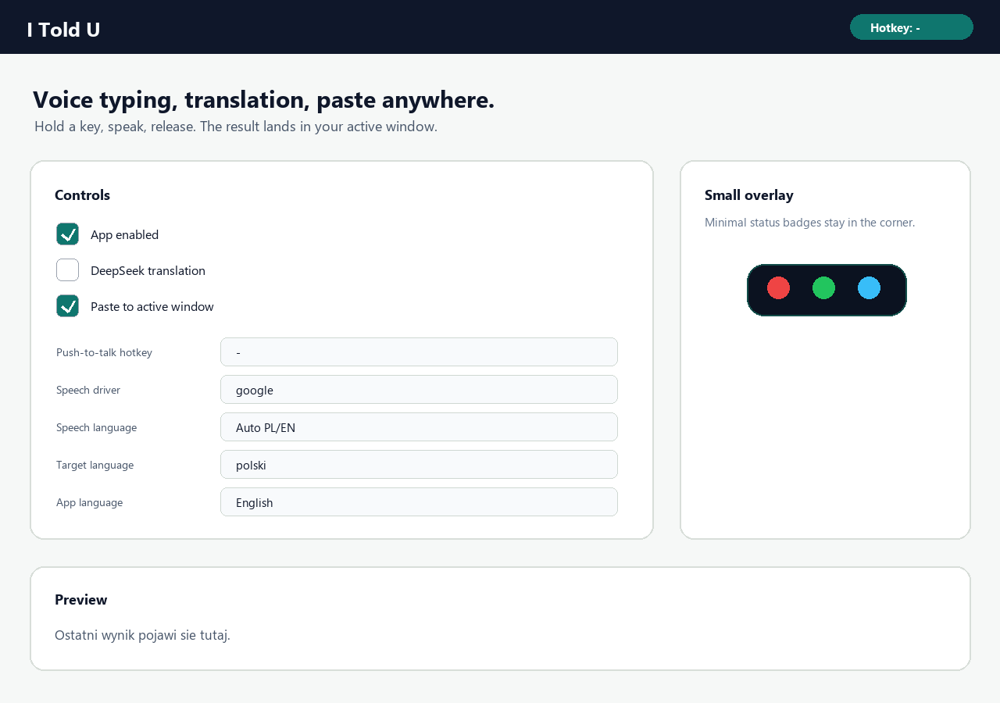

# I Told U

Lekka aplikacja do dyktowania tekstu do dowolnego aktywnego okna. Przytrzymujesz hotkey, mowisz, puszczasz, a aplikacja rozpoznaje mowe, opcjonalnie tlumaczy przez DeepSeek i wkleja wynik tam, gdzie byl fokus: Telegram, VS Code, przegladarka, dokument itd.



## Co potrafi

- Push-to-talk: nagrywa tylko wtedy, gdy trzymasz ustawiony klawisz.
- Wklejanie do aktywnego okna po puszczeniu hotkeya.
- Tryb bez tlumaczenia: sama mowa na tekst.
- Tryb z tlumaczeniem: rozpoznany tekst idzie przez DeepSeek na wybrany jezyk.
- Dokladny hotkey po fizycznym klawiszu, wiec lewy i prawy taki sam klawisz moga byc rozroznione.
- Maly overlay statusu w rogu ekranu: nagrywanie, przetwarzanie, wklejanie.
- Autostart po zalogowaniu do Windows i start zminimalizowany.
- Klucz API moze byc w `.env` albo zapisany z poziomu appki. Lokalny klucz na Windows jest zapisywany przez DPAPI, a nie jako zwykly tekst.
- UI w kilku jezykach.

## Najprostsze uruchomienie na Windows

1. Pobierz paczke `I-Told-U-windows` z zakladki **Actions** albo **Releases** na GitHubie.
2. Rozpakuj ZIP.
3. Uruchom:

```text
I-Told-U.exe
```

Jesli Windows pokaze ostrzezenie SmartScreen, kliknij **More info** / **Wiecej informacji**, potem **Run anyway** / **Uruchom mimo to**. To normalne przy malych aplikacjach bez podpisu certyfikatem.

## Uruchomienie ze zrodel na Windows

Wymagania: Python 3.12.

```powershell
git clone https://github.com/szansky/itoldu.git
cd itoldu
copy .env.example .env
notepad .env
Set-ExecutionPolicy -Scope Process Bypass
.\run.ps1
```

W pliku `.env` wpisz swoj klucz:

```env
DEEPSEEK_API_KEY=your_deepseek_api_key_here
```

Plik `.env` jest ignorowany przez git. Nie wrzucaj tam cudzego ani prywatnego klucza do repo.

## Jak uzywac

1. Wybierz mikrofon.
2. Kliknij **Zlap klawisz** i nacisnij klawisz, ktory ma byc hotkeyem.
3. Zostaw wlaczone **Paste to active window**, jesli tekst ma sam trafic do aktualnego okna.
4. Jesli chcesz, zaznacz **Launch on Windows startup** oraz **Start minimized**.
5. Jesli chcesz samo dyktowanie, wylacz **DeepSeek translation**.
6. Jesli chcesz tlumaczenie, wlacz **DeepSeek translation** i wybierz jezyk docelowy.
7. Przytrzymaj hotkey, powiedz zdanie, pusc hotkey.

Domyslny hotkey po pierwszym uruchomieniu to `-`.

## Build EXE na Windows

```powershell
Set-ExecutionPolicy -Scope Process Bypass
.\build_windows.ps1
```

Gotowy plik bedzie tutaj:

```text
dist\I-Told-U\I-Told-U.exe
```

## Linux

Linux build jest przygotowany, ale globalne hotkeye i wklejanie zaleznie od systemu moga wymagac dodatkowych uprawnien albo pakietow.

```bash
git clone https://github.com/szansky/itoldu.git
cd itoldu
cp .env.example .env
nano .env
bash build_linux.sh
```

Gotowy plik bedzie tutaj:

```text
dist/i-told-u/i-told-u
```

Na Ubuntu przy recznym uruchamianiu przydatne pakiety:

```bash
sudo apt-get install portaudio19-dev python3-tk xclip xdotool
```

## DeepSeek API

Najbezpieczniejsza opcja:

```env
DEEPSEEK_API_KEY=your_deepseek_api_key_here
```

Aplikacja wspiera tez starsza nazwe:

```env
DEEP_SEEK_API=your_deepseek_api_key_here
```

Mozesz tez wkleic klucz w aplikacji i kliknac **Save key**. Pole nie pokazuje zapisanego klucza po ponownym starcie, zeby nie swiecic sekretem na ekranie.

## Prywatnosc

- Repo nie zawiera prawdziwego klucza API.
- `.env` i `.env.*` sa ignorowane przez git.
- Domyslny sterownik `google` wysyla audio do Google Web Speech.
- Opcjonalny `whisper_local` dziala lokalnie, ale wymaga wiecej RAM:

```powershell
.\.venv\Scripts\python.exe -m pip install faster-whisper
```

## Gdy cos nie dziala

- Hotkey nie reaguje: kliknij **Zlap klawisz** jeszcze raz i zapisz ustawienia.
- Ten sam klawisz po lewej i prawej stronie klawiatury: ustaw hotkey przez **Zlap klawisz**, aplikacja zapisuje fizyczny scan code.
- Nie wkleja tekstu: sprawdz, czy wlaczone jest **Paste to active window**.
- Brak tlumaczenia: sprawdz `.env`, klucz API i czy wlaczone jest **DeepSeek translation**.
- Mikrofon nie lapie glosu: wybierz mikrofon z listy i kliknij odswiezanie.

## Dla developerow

```powershell
.\.venv\Scripts\python.exe -m compileall app.py
.\.venv\Scripts\python.exe tools\render_assets.py
```

GitHub Actions buduje paczki dla Windows i Linux po pushu na `main`.
